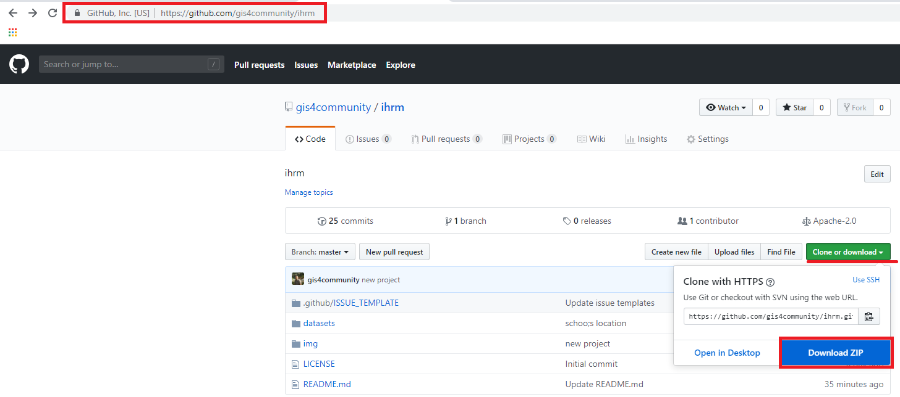
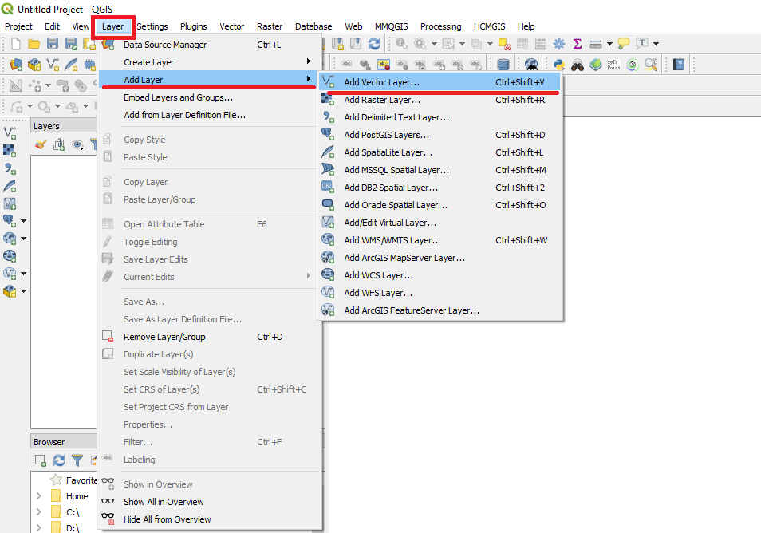
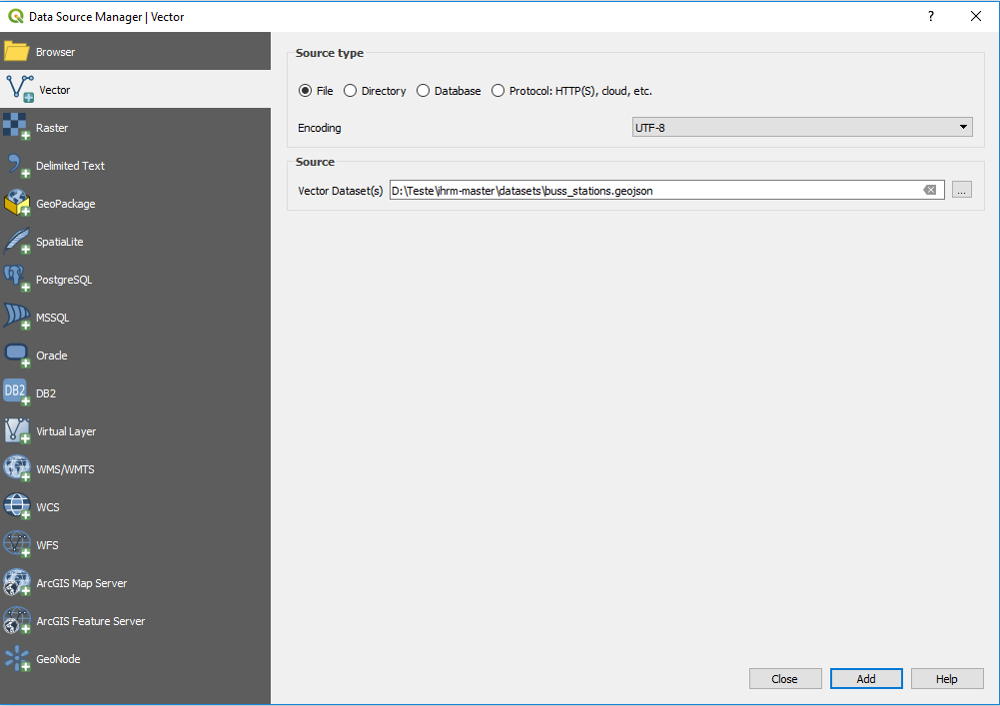
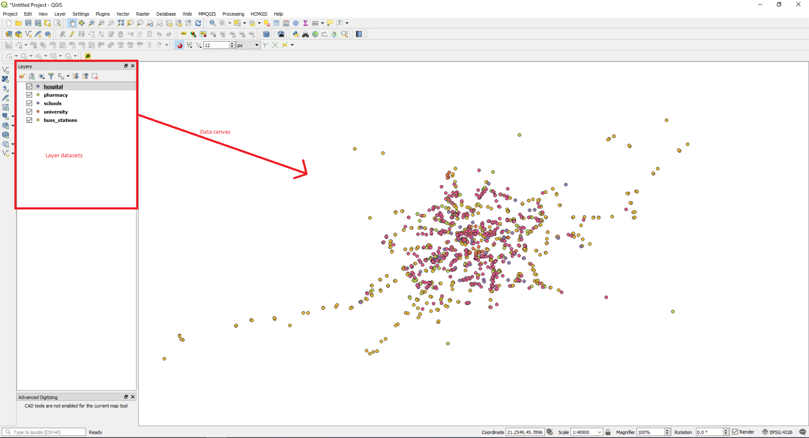
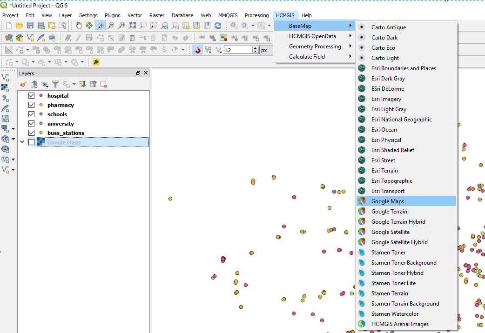
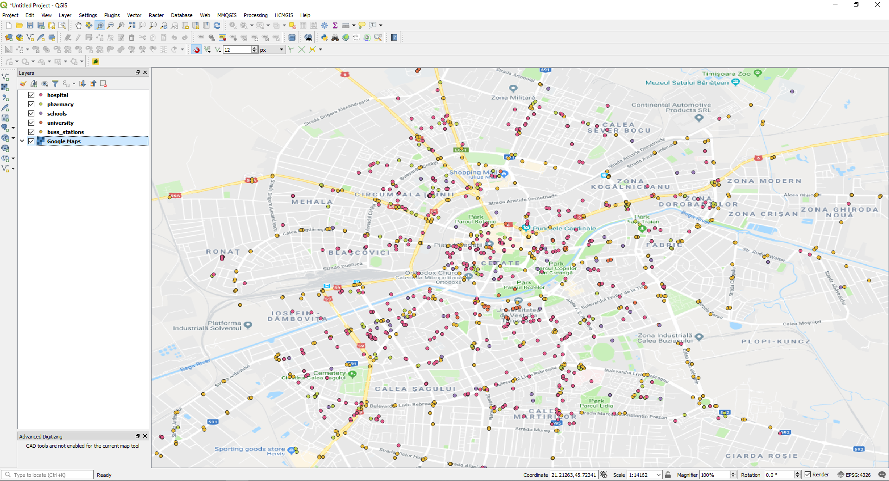
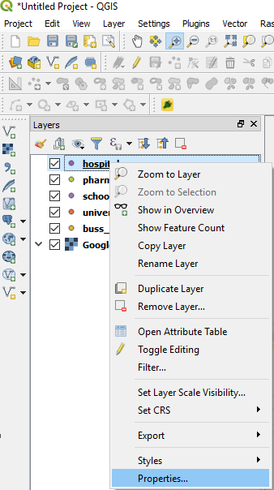
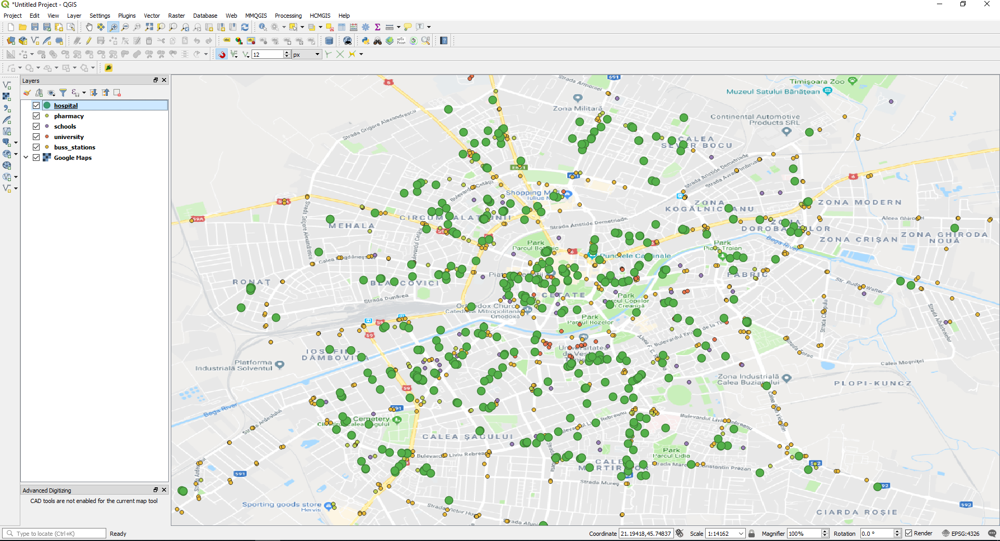

# UVT FEAA IHRM SPRING SCHOOL 

This repository store free data sets for digital maps workshops.

Each set of data wold be used on practical exercises for managing digital maps content.

Please read bellow a step by step guide for requirements:

**The result of this tutorial**
Visit the GeoMap at [https://gis4community.github.io/ihrm/](https://gis4community.github.io/ihrm/) 

# 1. Download free and open source QGIS software
Go to [QGIS homepage](http://qgis.com/) 

Click "Download Now" button

**Install the software as normal one.**
**Please view next video:**  [video](http://www.youtube.com/watch?v=7aK1nT7iBlc)

# 2. Verify if QGIS works by opening it
If everithing works as expected until now let's install a usefull extension

 ###### - In QGIS go to menu Plugins --> Manage and Install Plugins..
 
 

###### - In Plugin window tipe **HCMGIS**

 
 
###### - Click the button "Install Plugin"

After installation the new menu appears in QGIS

# 3. Create new map project

###### Go to menu Project --> and click New

**Now since we have a new peokject configured is time to get data in your computer** 

# 4. Download data locally in your computer

   ###### Go to [https://github.com/gis4community/ihrm](https://github.com/gis4community/ihrm)
   ###### Click the green button "Clone or download" --> "Download ZIP"
   
   
   
 ###### Save the ZIP data in any location in your pc
 ###### Unzip data
 
 # 5. Add data in project map

###### Go to menu **Layer --> Add Layer --> Add Vector Layer...**

**Navigate to your saved data folder**
###### Select **buss_stations.geojson** dataset

###### !Observation: **Repeat step 5 for all datasets**

After adding all datasets in your map project, the result would looks like this:

# 6. Add Google Maps base layer

###### Go to menu **HCMGIS--> BaseMap --> Google Maps**

After adding Google Maps in your map project, the result would looks like this:

###### !Observation: **Repeat last step and try to add different base maps**
 
 # 7. Change the symbol of layers
 
 ###### Select first layer. Click mouse right and select **Properties**
 
 

###### From the open window select Style tab
###### From tab body select green bullet and press OK
**The result would looks like this:**

 

###### !Observation: **Repeat step 7 for all layers and color your map as you want**

# 8. Edit data

# 9. Print the Map
